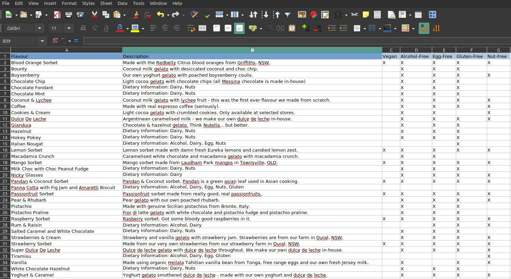
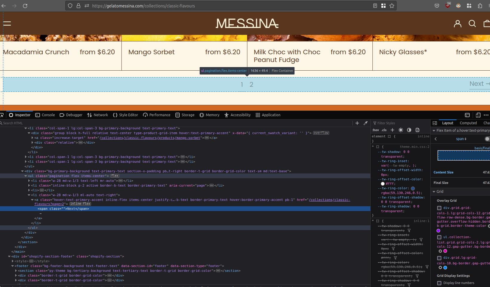

# Gelato Web Scraper

Web scraper for downloading icecream names, descriptions and dietary requirements into an excel spreadsheet.

I created this web scraper to have data to practice in my [PostgreSQL Database Design Exercise](https://github.com/lmponcio/postgresql-icecream-db).

### Output Spreadsheet



### Inspection
Here is a screenshot of the inspection for the pagination link. This was a crucial part of the web scraper (to prevent having to hard-code each page into the script).



### Navigation Through Pagination (explanation)

I navigated through pagination by sending a request for each "Next" button found:

```python
# scraper.py
# ...
def get_flavours_through_pagination(full_url,add_description=False):
    next=(True, full_url)
    flavours_collected=[]
    while True:
        full_url=next[1]
        response =requests.get(full_url)
        flavours=get_flavours(response,add_description=add_description)
        flavours_collected.extend(flavours)
        next=get_next_pagination_href(full_url)
        print("next is ", next)
        if next[0] == False:
            print("finished!")
            break
    return flavours_collected
# ...
```
The `get_next_pagination_href` function will return a tuple with `True` as first item if a link to the next page was found. When the "Next" button can't be found, the script will not try to send a new request for that section (tuple with `False` as first item is returned).
```python
# ...
def get_next_pagination_href(base_url):
    """ Returns a tuple with a boolean and the href if present

    If boolean True -> there is a next page, and the second element is the link

    """
    response =requests.get(base_url)
    soup = bs4.BeautifulSoup(response.content,"lxml")
    ul=soup.find('ul',{"class":"pagination flex items-center"})  
    if ul is not None:
        for element in ul.children:
            try:
                anchor=element.find("a")
                span=anchor.find("span")
                if "Next" in span.text:
                    return (True, BASE_URL+anchor['href']) 
            except:
                pass
    return (False, None)
# ...
```

